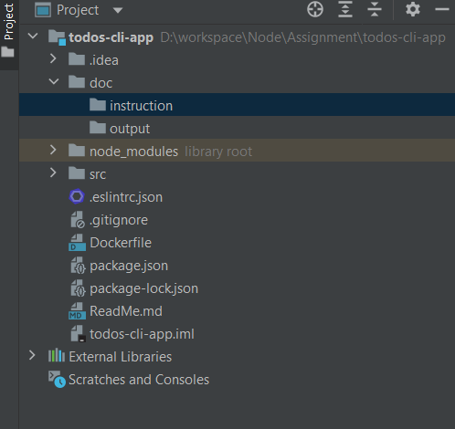
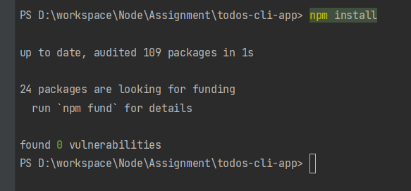
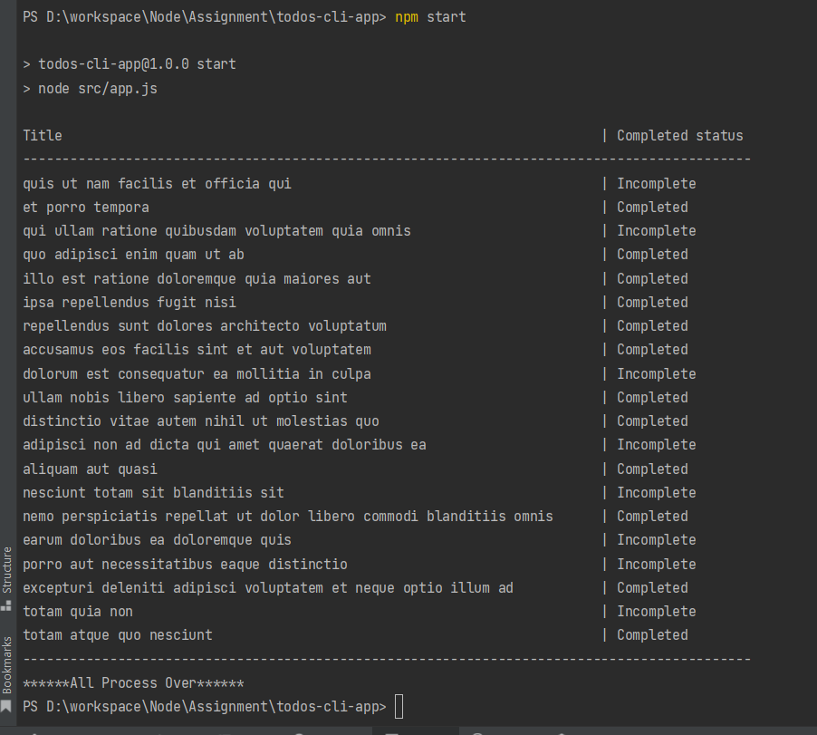

# Todo CLI App

## Description
This is a command-line application built to fetch and display TODO items from an API.
```aidl
TODO at index 1 can be accessed at: https://jsonplaceholder.typicode.com/todos/1

TODO at index 2 can be accessed at: https://jsonplaceholder.typicode.com/todos/2
```
The goal of the project is to build a command-line tool that consumes the first 20 even numbered TODOs and outputs their title and completion status.

## Implementation
The application is built using Node.js and utilizes Axios for making HTTP requests. It fetches the TODO items from the JSONPlaceholder API and displays them in a tabular format.

## Project Structure


## How to Run Locally
1. Clone this repository to your local machine.
2. Navigate to the project directory.
3. Install dependencies by running: ```$npm install```

4. Run the application using: ``` $npm start ```
5. The application will fetch the TODO items and display them in the console as like below.


## How to Run with Docker
1. Ensure Docker is installed on your machine.
2. Clone this repository to your local machine.
3. Navigate to the project directory.
4. Build the Docker image by running:
```aidl
docker build -t todos-cli-app .
```
5. Once the image is built, run a container based on the image using:
```aidl
docker run todos-cli-app
```

6. The application will fetch the TODO items and display them in the console.

## Dependencies
- Axios: ^1.6.7

